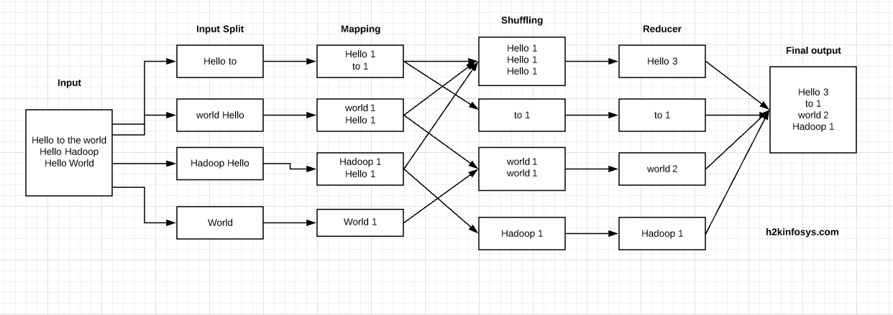
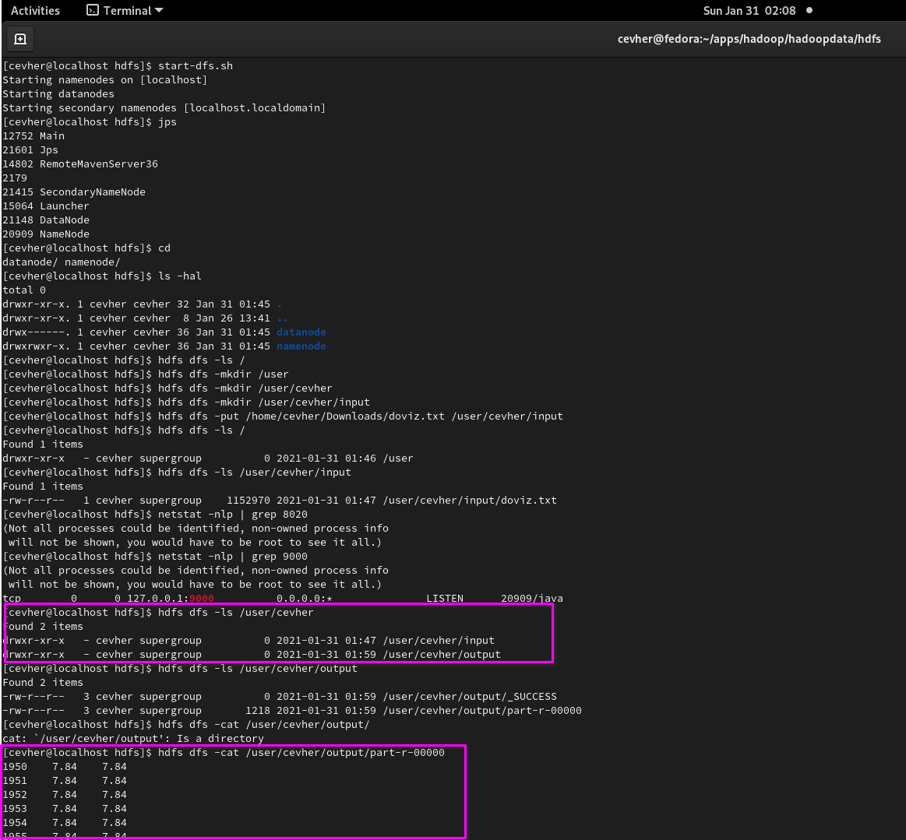

# hadoop-mr-example-currency

Hadoop & Mapreduce Examples: Create First Program in Java
https://hadoop.apache.org/docs/r1.2.1/mapred_tutorial.html

What is MapReduce?

MapReduce is a processing technique and a program model for distributed computing based on java. The MapReduce algorithm contains two important tasks, namely Map and Reduce. Map takes a set of data and converts it into another set of data, where individual elements are broken down into tuples (key/value pairs). Secondly, reduce task, which takes the output from a map as an input and combines those data tuples into a smaller set of tuples. As the sequence of the name MapReduce implies, the reduce task is always performed after the map job.

The major advantage of MapReduce is that it is easy to scale data processing over multiple computing nodes. Under the MapReduce model, the data processing primitives are called mappers and reducers. Decomposing a data processing application into mappers and reducers is sometimes nontrivial. But, once we write an application in the MapReduce form, scaling the application to run over hundreds, thousands, or even tens of thousands of machines in a cluster is merely a configuration change. This simple scalability is what has attracted many programmers to use the MapReduce model.

output: 
